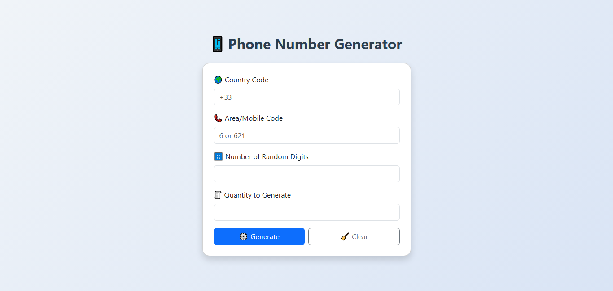

# 📱 Phone Number Generator App

A simple PHP web application to generate random phone numbers with customizable options like country code, area code, digit length, and quantity. Export the numbers to a downloadable CSV file.

## 🚀 Features

- Generate random phone numbers
- Customize:
  - Country Code (e.g. +91, +1)
  - Area Code (optional)
  - Number of digits (e.g. 8-digit numbers)
  - Quantity (e.g. 100 numbers)
- Download generated numbers as `.csv`
- Responsive UI with Bootstrap

## 🖼️ Preview

 <!-- Replace with your image path -->

## 🛠️ Tech Stack

- PHP
- HTML/CSS
- Bootstrap
- JavaScript (optional)
- File Handling (CSV export)

## 📁 Project Structure

